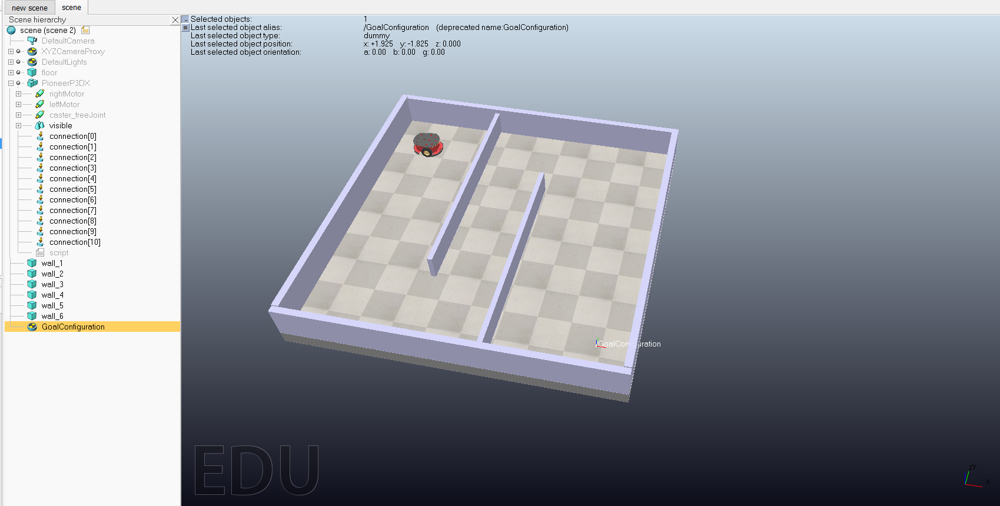
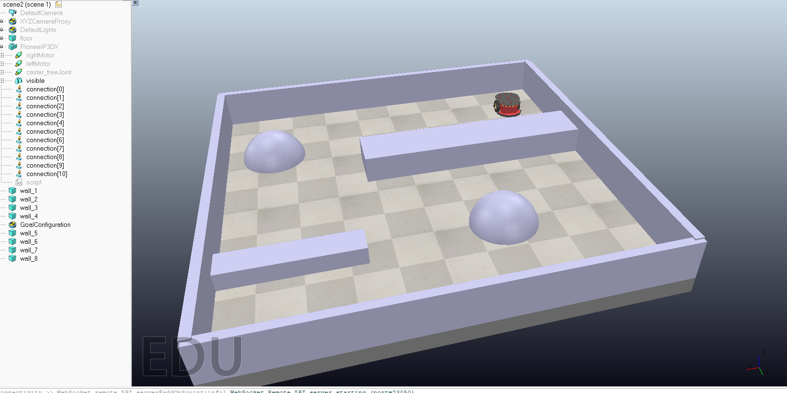
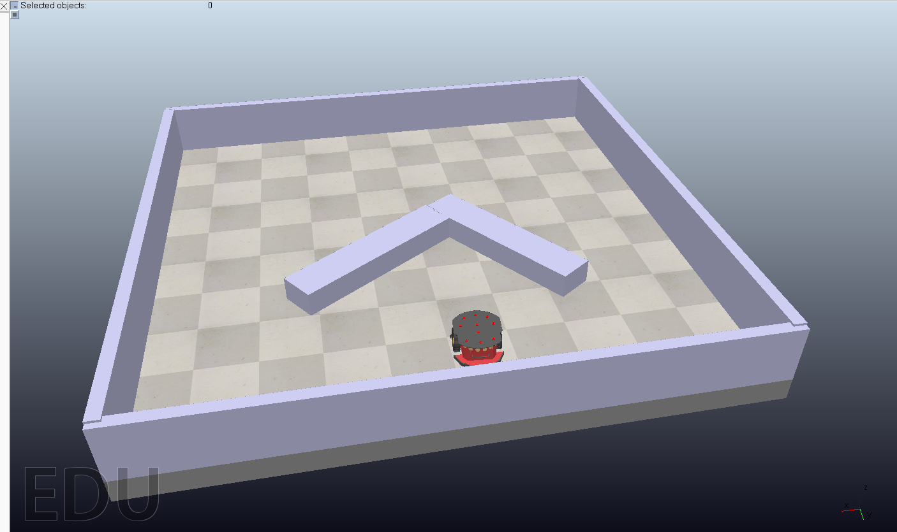

# Planejamento de Caminho com Algoritmos Baseados em Amostragem

Este repositório contém a implementação e a avaliação de algoritmos de planejamento de caminho baseados em amostragem para o TCC, incluindo integração com o CoppeliaSim para navegação simulada de um robô móvel.

## Visão Geral

O projeto é focado em planejamento de caminho em ambientes 2D com obstáculos usando variantes da família RRT. O planejador principal é implementado em Python, enquanto o CoppeliaSim é usado como ambiente de simulação para validar a navegação do robô.

Atualmente, o repositório já inclui:

- `RRT`
- `RRT*`
- `RRT-Connect`
- `Informed RRT*`
- `RRT*-Smart`

O trabalho também inclui:

- experimentos em lote com métricas
- comparações entre cenários
- navegação no CoppeliaSim usando a geometria da cena como obstáculo
- exportação dos resultados das execuções em JSON

## Cenas Utilizadas no CoppeliaSim

O projeto utiliza mais de uma cena de simulação no CoppeliaSim para avaliar os algoritmos em configurações geométricas diferentes.

### Cenário 1: corredor com parede angular

A primeira cena é um ambiente semelhante a um corredor, contendo:

- um robô móvel `PioneerP3DX`
- seis paredes: `wall_1` até `wall_6`
- um alvo representado pelo dummy `GoalConfiguration`
- um piso usado para definir os limites do mundo

A figura abaixo mostra esse cenário:



Nessa configuração:

- o robô inicia no lado esquerdo do ambiente
- o dummy de objetivo é movido para diferentes posições para avaliar a navegação
- as paredes formam passagens estreitas e estruturas semelhantes a becos sem saída
- o planejador lê a geometria das paredes da cena e a converte em obstáculos 2D para o planejamento

### Cenário 2: corredor com barreiras retangulares e obstáculos arredondados

O segundo cenário adiciona maior variedade geométrica ao ambiente:

- paredes externas `wall_1 ... wall_8`
- duas barreiras retangulares internas
- dois obstáculos arredondados posicionados na região central
- robô e objetivo em lados opostos do ambiente

Esse cenário é útil para avaliar como os algoritmos se comportam com obstáculos de formatos diferentes e com múltiplas rotas possíveis:



### Cenário 3: ambiente aberto com obstáculo interno em ângulo

O terceiro cenário é mais simples geometricamente, mas útil para avaliar desvio e escolha de lado em torno de um obstáculo:

- paredes externas delimitando a área de navegação
- um obstáculo interno em formato angular
- espaço livre mais amplo ao redor do obstáculo
- maior liberdade para comparar o formato dos caminhos gerados

Esse cenário ajuda a analisar eficiência de caminho, suavidade e tendência de exploração:



## O Que Já Foi Implementado

### Algoritmos

- `RRT`: planejador básico com uma única árvore
- `RRT*`: versão otimizada com rewiring
- `RRT-Connect`: planejador bidirecional com conexão agressiva
- `Informed RRT*`: restringe a amostragem após a primeira solução usando uma elipse informada
- `RRT*-Smart`: melhora a amostragem em torno do melhor caminho usando refinamento guiado por beacons

### Infraestrutura de Avaliação

- cenários 2D pré-definidos para testes controlados
- métricas de comprimento de caminho, suavidade, clearance, tempo de planejamento e eficiência
- execução em lote com múltiplas sementes
- exportação de resultados em JSON e CSV

### Integração com o CoppeliaSim

- conexão com o CoppeliaSim via ZMQ Remote API
- leitura da posição do objetivo a partir de `/GoalConfiguration`
- leitura da geometria das paredes da cena ativa, como `wall_1 ... wall_6` ou `wall_1 ... wall_8`
- planejamento com a implementação em Python do algoritmo selecionado
- seguimento dos waypoints gerados com o robô Pioneer
- métricas de execução como replans, erro final até o objetivo e tempo de execução

## Como Está a Amostragem em Cada Algoritmo

As implementações atuais usam as seguintes estratégias de amostragem:

- `RRT`
  Usa amostragem uniforme no mapa com viés para o objetivo. Com probabilidade `goal_sample_rate`, a amostra é o próprio objetivo; caso contrário, o ponto é sorteado uniformemente dentro dos limites do mapa. O número máximo de amostras é controlado por `max_iter`, pois cada iteração gera uma nova amostra. Código: `path-planning/algorithms/rrt.py`, método `get_random_point`.
- `RRT*`
  Usa a mesma amostragem do `RRT`: uniforme no mapa com viés para o objetivo. A diferença principal está no rewiring e na escolha do melhor pai para cada novo nó. O número máximo de amostras também é controlado por `max_iter`. Código: `path-planning/algorithms/rrt_star.py`, método `get_random_point`.
- `RRT-Connect`
  Também usa amostragem uniforme com goal bias, mas trabalha com duas árvores, uma a partir do início e outra a partir do objetivo. Uma árvore é expandida em direção à amostra e a outra tenta se conectar agressivamente ao novo nó. Nesse caso, o limite é dado por `max_samples`, que representa o número máximo de amostras aleatórias usadas na expansão; no restante do projeto, esse valor recebe o valor de `max_iter` para manter a interface uniforme. Código: `path-planning/algorithms/rrt_connect.py`, método `get_random_point` e função `step`.
- `Informed RRT*`
  Antes da primeira solução, usa amostragem uniforme com goal bias, como no `RRT*`. Depois que encontra um caminho inicial, passa a amostrar dentro de uma elipse informada entre início e objetivo, concentrando a busca em regiões mais promissoras. O número máximo de amostras continua sendo controlado por `max_iter`. Código: `path-planning/algorithms/informed_rrt_star.py`, métodos `get_random_point` e `_sample_in_ellipse`.
- `RRT*-Smart`
  Usa a mesma amostragem do `RRT*` no início. Depois que encontra um bom caminho, cria beacons internos ao longo da solução atual e, com probabilidade `beacon_sample_rate`, passa a amostrar perto desses beacons dentro de um raio `beacon_radius`. O número máximo de amostras também é dado por `max_iter`. Código: `path-planning/algorithms/rrt_star_smart.py`, métodos `get_random_point`, `_sample_near_beacon` e `_update_solution`.

Em todas as variantes, a amostra sorteada não vira nó diretamente. O algoritmo usa a função `steer` para avançar apenas um passo de tamanho `step_size` na direção da amostra, e só adiciona o novo nó se o segmento gerado for livre de colisão.

Nos comandos documentados neste repositório para o CoppeliaSim, o valor de referência mais usado é `--max-iter 10000`. Na prática, isso significa:

- `RRT`: até `10000` amostras
- `RRT*`: até `10000` amostras
- `RRT-Connect`: até `10000` amostras aleatórias na expansão das duas árvores
- `Informed RRT*`: até `10000` amostras, sendo uniformes no início e informadas após a primeira solução
- `RRT*-Smart`: até `10000` amostras, sendo uniformes no início e guiadas por beacons depois de uma boa solução

## Funcionalidades

- planejamento de caminho baseado em amostragem em Python
- múltiplas variantes de RRT da literatura
- automação de experimentos
- integração com o CoppeliaSim
- execuções reprodutíveis com controle de semente
- exportação de resumos de execução para análise no TCC

## Instalação

Configuração básica:

```powershell
cd path-planning
python -m venv ..\venv
..\venv\Scripts\Activate.ps1
pip install -r requirements.txt
```

## Uso

### Experimentos em lote em 2D

Exemplo:

```powershell
python -m experiments.run_rrt_batch --algo rrt_star --scenario corredor --runs 20
```

Outros exemplos:

```powershell
python -m experiments.run_rrt_batch --algo rrt --scenario complexo --runs 20
python -m experiments.run_rrt_batch --algo rrt_connect --scenario complexo --runs 20
python -m experiments.run_rrt_batch --algo informed_rrt_star --scenario complexo --runs 20
python -m experiments.run_rrt_batch --algo rrt_star_smart --scenario corredor --runs 20 --beacon-sample-rate 0.35 --beacon-radius 8
```

### Teste no CoppeliaSim

Com a cena carregada e a simulação em execução:

```powershell
python path-planning\coppeliasim\connect_test.py
```

Exemplo com `RRT*`:

```powershell
python path-planning\coppeliasim\rrt_navigation.py --algo rrt_star --robot-path /PioneerP3DX --left-motor-path /PioneerP3DX/leftMotor --right-motor-path /PioneerP3DX/rightMotor --goal-object /GoalConfiguration --walls-object='' --step-size 0.25 --neighbor-radius 0.5 --max-iter 10000 --waypoint-tolerance 0.08 --goal-tolerance 0.10 --linear-speed 0.15 --heading-stop-threshold 0.45 --inflate 0.18 --seed 1 --save-run-json results\coppelia_rrt_star.json
```

Exemplo com `Informed RRT*`:

```powershell
python path-planning\coppeliasim\rrt_navigation.py --algo informed_rrt_star --robot-path /PioneerP3DX --left-motor-path /PioneerP3DX/leftMotor --right-motor-path /PioneerP3DX/rightMotor --goal-object /GoalConfiguration --walls-object='' --step-size 0.25 --neighbor-radius 0.5 --max-iter 10000 --waypoint-tolerance 0.08 --goal-tolerance 0.10 --linear-speed 0.15 --heading-stop-threshold 0.45 --inflate 0.18 --seed 1 --save-run-json results\coppelia_informed_rrt_star.json
```

## Métricas Utilizadas

O projeto utiliza as seguintes métricas:

- `success`
  Indica se a execução foi considerada bem-sucedida. No `rrt_navigation.py`, vale `True` apenas quando o erro final até o objetivo é menor ou igual a `goal_tolerance` e a execução não termina por travamento, falha de replanejamento ou parada por risco de colisão.
- `planning_time`
  Tempo total de planejamento em segundos. É medido como a diferença entre o instante antes de chamar o planejador e o instante em que o caminho é encontrado. Quando há replans, o tempo de replanejamento é somado ao total.
- `execution_time`
  Tempo total gasto para o robô executar o caminho no CoppeliaSim, do início do seguimento dos waypoints até a parada final.
- `path_length`
  Comprimento total do caminho. É calculado como a soma das distâncias euclidianas entre cada par de pontos consecutivos do caminho.
- `path_smoothness`
  Mede o quanto o caminho muda de direção. É calculada como a soma das variações de ângulo entre segmentos consecutivos. Quanto menor esse valor, mais suave é o caminho.
- `clearance`
  É a menor distância entre o caminho e os obstáculos. No código, para cada ponto do caminho, calcula-se a distância até o ponto mais próximo de cada obstáculo retangular, e o menor valor encontrado ao longo de todo o caminho é retornado. Em termos práticos, clearance pequeno significa que o caminho passa muito perto da parede.
- `num_nodes`
  Número de nós gerados pela árvore do algoritmo durante o planejamento. É obtido pelo tamanho da estrutura `tree` do planejador.
- `replans`
  Número de vezes em que o robô ficou sem progresso suficiente durante a execução e precisou planejar um novo caminho a partir da posição atual.
- `final_goal_error`
  Distância final entre a posição do robô e o último waypoint do caminho, em metros no cenário do CoppeliaSim.
- `straight_line_distance`
  Distância em linha reta entre o ponto inicial e o ponto final do caminho. É calculada por distância euclidiana direta entre início e objetivo.
- `path_efficiency`
  Mede o quão direto é o caminho. Em geral, pode ser interpretado pela relação entre a distância em linha reta e o comprimento total do caminho. Quanto mais próximo de 1, mais eficiente é o trajeto.
- `termination_reason`
  Motivo de encerramento da execução. Ajuda a interpretar o resultado experimental, distinguindo entre conclusão normal, travamento com máximo de replans, falha de replanejamento ou parada por risco de colisão.

## Roadmap

- [x] Implementar `RRT`
- [x] Implementar `RRT*`
- [x] Implementar `RRT-Connect`
- [x] Implementar `Informed RRT*`
- [x] Implementar `RRT*-Smart`
- [x] Integrar os planejadores com o CoppeliaSim
- [x] Adicionar métricas de experimento e exportação em JSON
- [ ] Executar experimentos comparativos completos com múltiplas sementes
- [ ] Consolidar tabelas e gráficos para o relatório do TCC

## Observação

O planejador usado nos experimentos é a implementação em Python deste repositório. O CoppeliaSim é usado como ambiente de simulação e como fonte de geometria da cena, e não como algoritmo principal de planejamento.
