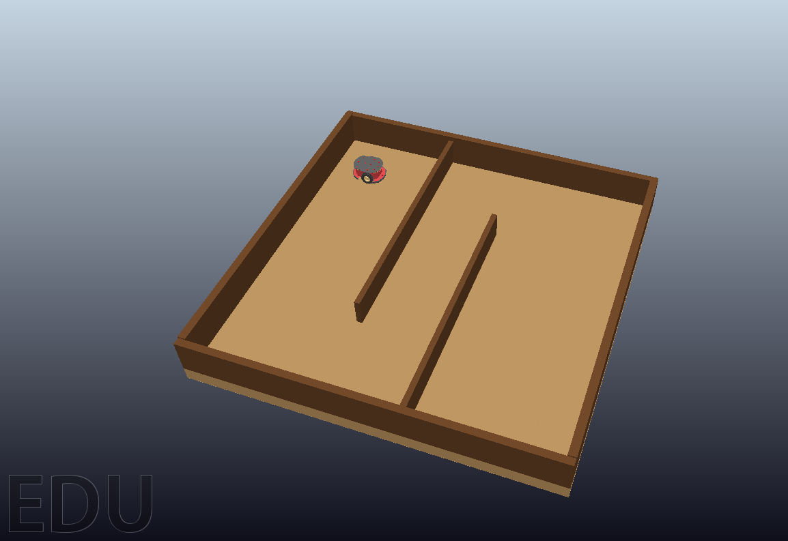
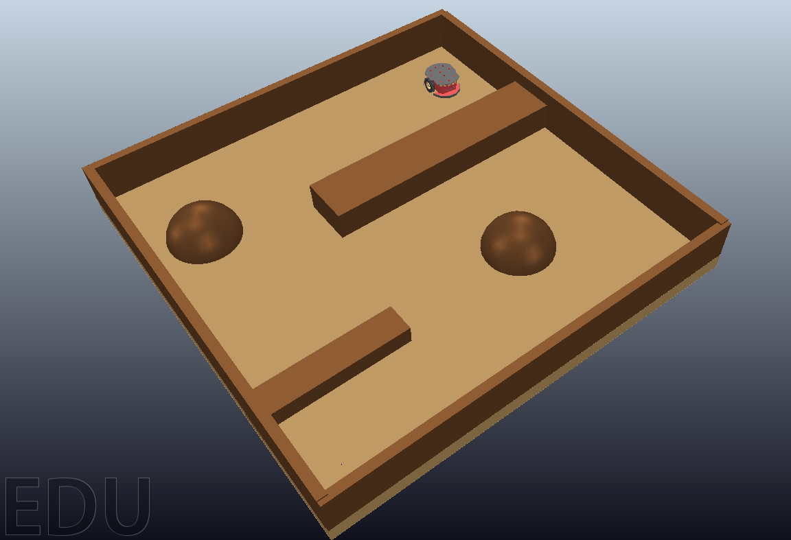
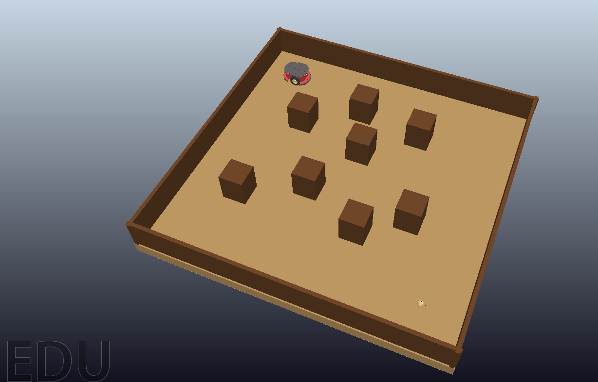
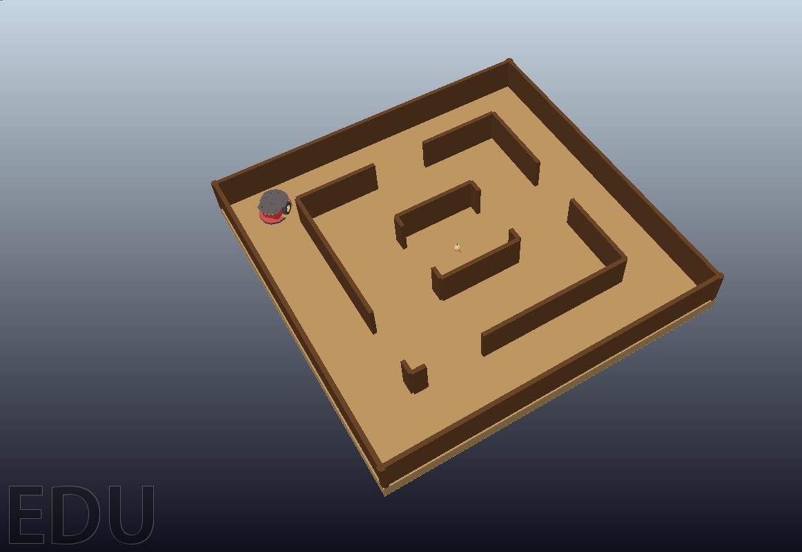

# Avaliação comparativa de algoritmos baseados em amostragem para planejamento de caminhos em robôs móveis

Este repositório contém a implementação e a avaliação experimental de três algoritmos clássicos de planejamento de caminhos baseados em amostragem, **RRT**, **RRT-Connect** e **EST**, aplicados à navegação de um robô móvel diferencial **Pioneer P3DX** no simulador **CoppeliaSim**.

---

## O que foi feito

Durante o desenvolvimento deste TCC, foram realizadas as seguintes etapas:

### 1. Implementação dos algoritmos

Os três algoritmos de planejamento foram implementados em Python na pasta `path-planning/algorithms/`:

| Algoritmo | Arquivo | Estratégia |
|---|---|---|
| **RRT** | `rrt.py` | Expansão incremental unidirecional |
| **RRT-Connect** | `rrt_connect.py` | Busca bidirecional com duas árvores |
| **EST** | `est.py` | Seleção de nós baseada em densidade local |

### 2. Construção dos cenários

Quatro cenários distintos foram modelados no CoppeliaSim para representar diferentes desafios de navegação:

#### Cena 1: corredor estreito
Duas paredes paralelas formam um corredor que o robô precisa atravessar.

<p align="center">
  
</p>


<video src="https://github.com/user-attachments/assets/fb46a86c-9a8c-4b4c-8455-cfaebc8eaab5" controls width="500"></video>
<p align="center">
Vídeo: robô navegando na Cena 1 (RRT)
</p>


#### Cena 2: obstáculos arredondados
Obstáculos arredondados espalhados.

<p align="center">
  
</p>

<video src="https://github.com/user-attachments/assets/0e4e65a6-7982-4c0f-a2c4-9e8c9ab59523" controls width="500"></video>
<p align="center">
 Vídeo: robô navegando na Cena 2 (RRT-Connect)
</p>

#### Cena 3: pilares cúbicos dispersos
Espaço aberto com pilares quadrados distribuídos pela arena.

<p align="center">
  
</p>


<video src="https://github.com/user-attachments/assets/eb83e129-1e39-411d-958c-7f49f87d925c" controls width="500"></video>
<p align="center">
 Vídeo: robô navegando na Cena 3 (EST)
</p>


#### Cena 4: labirinto
Labirinto com paredes internas e externas e múltiplas entradas.

<p align="center">
  
</p>


<video src="https://github.com/user-attachments/assets/ffe6167e-996a-40ab-90a5-7a2f11d5a3f4" controls width="500"></video>
<p align="center">
Vídeo: robô navegando na Cena 4 (EST)
</p>

<video src="https://github.com/user-attachments/assets/ddfed765-4e24-4f7a-bb0b-a130080823c0" controls width="500"></video>
<p align="center">
 Vídeo: robô navegando na Cena 4 (RRT-Connect)
</p>


### 3. Integração com o CoppeliaSim

A comunicação entre o Python e o CoppeliaSim foi feita pela **ZMQ Remote API**, o que permite controlar a simulação e ler o estado do robô sem precisar embutir código diretamente nas cenas. Toda a integração está em `path-planning/coppeliasim/`.

### 4. Extração de obstáculos e construção do mapa

Antes de cada execução, a geometria das paredes da cena é extraída do CoppeliaSim, inflada pelo raio do robô e convertida em um mapa bidimensional discreto de 100×100 pixels, usado como entrada para os planejadores. Essa etapa fica em `path-planning/planning_context/`.

### 5. Controlador do robô

Foi implementado um controlador de rodas em `path-planning/coppeliasim/wheel_controller.py`, que recebe a sequência de waypoints do planejador e guia o Pioneer P3DX pelo cenário, com mecanismos de *lookahead* e recuperação de bloqueio.

### 6. Pós-processamento dos caminhos

Os caminhos gerados pelos planejadores passam por uma etapa de pós-processamento composta por:
- **Encurtamento por shortcut**: remove waypoints intermediários desnecessários
- **Redensificação**: garante espaçamento uniforme entre os waypoints para facilitar o controle

### 7. Calibração de parâmetros

Antes da comparação final, foi feita uma etapa de calibração para escolher os melhores parâmetros de cada algoritmo. Os valores selecionados estão centralizados em `path-planning/run_planner_command.py` na forma de presets.

### 8. Experimentos comparativos

Os experimentos comparativos foram organizados na pasta `path-planning/experiments_tcc/`, com scripts para execução em lote e geração de gráficos a partir dos resultados.

---

## Tecnologias Utilizadas

- **Python 3** — linguagem principal
- **CoppeliaSim** (antigo V-REP) — simulador robótico
- **Shapely** — geometria e verificação de colisão
- **NumPy** — operações vetoriais
- **Matplotlib** — geração de gráficos
- **coppeliasim-zmqremoteapi-client** — comunicação com o simulador

---

## Estrutura do Repositório

```
tcc/
├── README.md                         
├── .gitignore
└── path-planning/                      
    ├── algorithms/                     # implementações dos algoritmos
    │   ├── rrt.py
    │   ├── rrt_connect.py
    │   ├── est.py
    │   └── ...
    ├── coppeliasim/                    # integração com o simulador
    │   ├── rrt_navigation.py           # script principal de execução
    │   ├── wheel_controller.py         # controlador do robô
    │   └── planner_isolated.py
    ├── planning_context/               # extração de contexto da cena
    ├── experiments_tcc/                # experimentos finais do TCC
    │   ├── parameter_sweep/            # calibração de parâmetros
    │   ├── final_comparison/           # comparação entre algoritmos
    │   ├── plots/                      # geração de gráficos
    │   └── results/                    # CSVs com resultados
    ├── scenes/                         # cenas do CoppeliaSim (.ttt)
    ├── images/                         # imagens dos cenários
    ├── tools/                          # utilitários
    │   ├── beautify_scene.py           # aplica temas visuais
    │   ├── plot_coppelia_results.py
    │   └── ...
    ├── utils/                          # funções geométricas
    ├── run_coppelia_batch.py           # execução em lote
    ├── run_planner_command.py          # presets de configuração
    └── requirements.txt
```

> **Observação:** o texto do TCC em LaTeX é mantido em um repositório separado do (Overleaf). Este repositório contém apenas o código-fonte, os experimentos e os dados gerados.

---

## Instalação

Configuração no Windows:

```powershell
# Clona o repositório
git clone <url-do-repo>
cd tcc

# Cria ambiente virtual
python -m venv venv
.\venv\Scripts\Activate.ps1

# Instala dependências
cd path-planning
pip install -r requirements.txt
```

---

## Como rodar

### Pré-requisitos

1. **CoppeliaSim** aberto
2. Uma das cenas carregada (arquivos `.ttt` em `path-planning/scenes/`)
3. Simulação iniciada

### Executar um experimento simples

A forma mais rápida é usar os presets prontos. Com a cena carregada e a simulação rodando:

```powershell
cd path-planning

# Roda o RRT
python run_planner_command.py rrt

# Roda o RRT-Connect
python run_planner_command.py rrt_connect

# Roda o EST
python run_planner_command.py est

# Lista todos os presets disponíveis
python run_planner_command.py list
```

O script vai:
1. Conectar ao CoppeliaSim
2. Extrair a cena (obstáculos, posições inicial e do objetivo)
3. Executar o algoritmo escolhido
4. Guiar o robô pelos waypoints gerados
5. Mostrar as métricas no terminal

### Executar a comparação completa

Para rodar uma comparação entre os três algoritmos no cenário atual:

```powershell
# Carregue a cena no CoppeliaSim antes (cena1, cena2, cena4 ou cena5)
python experiments_tcc/final_comparison/compare_best.py --scene cena4
```

Os resultados são salvos em `experiments_tcc/results/` em formato CSV.

### Gerar os gráficos

Após executar os experimentos, gera-se os gráficos comparativos com:

```powershell
python experiments_tcc/plots/summary_plots.py
```

Os gráficos ficam salvos em `experiments_tcc/plots/summary/`.

---

## Métricas Coletadas

Cada execução registra as seguintes métricas:

- **Taxa de sucesso**: se o robô chegou ao objetivo
- **Tempo de planejamento**: quanto tempo o algoritmo levou para gerar o caminho
- **Tempo de execução**: quanto tempo o robô levou para percorrer o caminho
- **Erro final**: distância entre a posição final do robô e o objetivo
- **Clearance mínima**: menor distância entre o caminho gerado e os obstáculos

Os valores são salvos em arquivos CSV dentro de `experiments_tcc/results/`.
